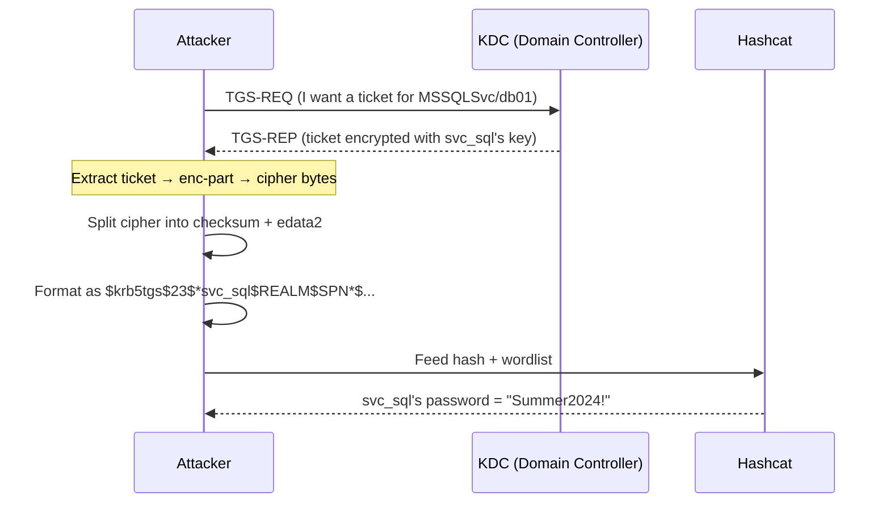
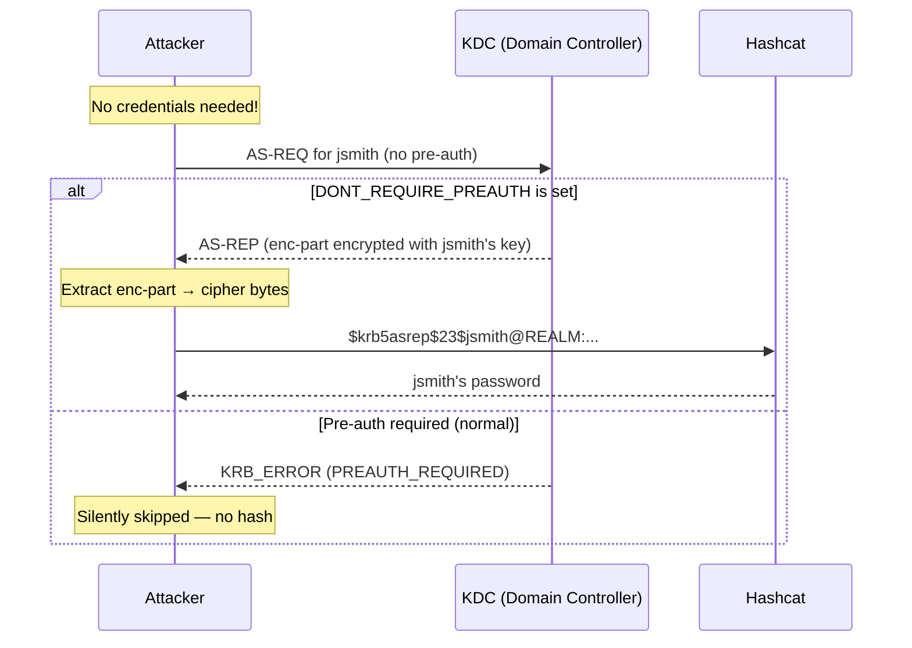
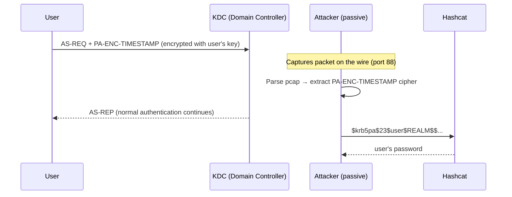

# Attacks in Depth

Protocol details for each attack. What Kerberos messages get targeted, what's encrypted with whose key, and which ASN.1 fields KerbWolf pulls the cipher from.

Quick overview and usage: [main guide](index.md).

---

## TGS-REP Roast (Kerberoast)

Any domain user with a TGT can request a service ticket for any account that has a `servicePrincipalName`. The KDC encrypts that ticket with the service account's long-term key. Extract the encrypted portion, crack it offline, recover the service account's password.

Service accounts running SQL, IIS, Exchange tend to have weak passwords and domain admin privileges. One cracked service account often gets you the whole domain.



| Detail | Value |
|--------|-------|
| **Kerberos message** | TGS-REP → `ticket` → `enc-part` |
| **Encrypted with** | Service account's long-term key (Key Usage 2) |
| **Cracks to** | Service account's password (RC4/AES) or 56-bit DES key |
| **Auth required?** | Yes — you need a TGT (password, hash, or ccache) |
| **Exception** | `--no-preauth` mode uses a DONT_REQ_PREAUTH account to request tickets via AS-REQ, bypassing authentication entirely |
| **KerbWolf tool** | `kw-roast` |

---

## AS-REP Roast

Accounts with the `DONT_REQUIRE_PREAUTH` flag skip pre-authentication. Send an AS-REQ for one of them and the KDC sends back an AS-REP with a portion encrypted using the user's key. You don't need credentials to ask.

Rarer than SPN misconfigurations, but when you find one, the hash is free.



| Detail | Value |
|--------|-------|
| **Kerberos message** | AS-REP → `enc-part` |
| **Encrypted with** | Client's long-term key (Key Usage 3) |
| **Cracks to** | User's password (RC4/AES) or 56-bit DES key |
| **Auth required?** | No (for the attack itself). LDAP discovery of vulnerable accounts needs auth. |
| **KerbWolf tool** | `kw-asrep` |

---

## AS-REQ Pre-Auth

During normal authentication, the AS-REQ contains an encrypted timestamp (`PA-ENC-TIMESTAMP`) as proof of identity. Capture it off the wire via tcpdump, Wireshark, or traffic mirroring and you can crack it offline.

Nothing gets sent to the KDC. You just need visibility into port 88 traffic. Every user who authenticates during your capture window produces a crackable hash.



| Detail | Value |
|--------|-------|
| **Kerberos message** | AS-REQ → `padata` → `PA-ENC-TIMESTAMP` |
| **Encrypted with** | Client's long-term key (Key Usage 1) |
| **Cracks to** | User's password (RC4/AES) or 56-bit DES key |
| **Auth required?** | No (offline pcap parsing) |
| **KerbWolf tool** | `kw-extract` |

---

## Side-by-side comparison

!!! tip "Who owns the key?"
    AS-REQ and AS-REP target the **client's** key (user's password). TGS-REP targets the **service's** key (service account's password).

| | TGS-REP | AS-REP | AS-REQ Pre-Auth |
|---|---|---|---|
| **Target** | Service account's key | User's key | User's key |
| **Auth needed** | Yes (TGT required) | No | No (passive) |
| **Source** | Live KDC request | Live KDC request | Packet capture |
| **Kerberos message** | TGS-REP ticket | AS-REP enc-part | AS-REQ padata |
| **ASN.1 path** | `ticket.enc-part.cipher` | `enc-part.cipher` | `padata.PA-ENC-TIMESTAMP.cipher` |
| **Prevalence** | Very common (any SPN account) | Rare (needs misconfiguration) | Depends on capture position |
| **Tool** | `kw-roast` | `kw-asrep` | `kw-extract` |

---

## LDAP target discovery

Both `kw-roast` and `kw-asrep` can query LDAP to find targets instead of requiring manual username lists. LDAP needs an authenticated bind first (NTLM or Kerberos).

### `--ldap` (targeted discovery)

With `--ldap`, KerbWolf runs a focused LDAP search that returns only accounts likely to be vulnerable.

**For `kw-roast --ldap`** the filter searches for accounts that have a `servicePrincipalName` set, are not disabled, and are not computer accounts:

```
(&(servicePrincipalName=*)(!(UserAccountControl:1.2.840.113556.1.4.803:=2))(!(objectCategory=computer)))
```

This returns service accounts like `svc_sql`, `svc_http`, `svc_backup` that have SPNs registered. KerbWolf takes the first SPN from each account and requests a service ticket for it.

**For `kw-asrep --ldap`** the filter searches for accounts with the `DONT_REQUIRE_PREAUTH` flag (UAC bit 4194304), excluding disabled and computer accounts:

```
(&(UserAccountControl:1.2.840.113556.1.4.803:=4194304)(!(UserAccountControl:1.2.840.113556.1.4.803:=2))(!(objectCategory=computer)))
```

This returns only accounts that are actually vulnerable to AS-REP roasting. If you see zero results, the domain has no misconfigured accounts.

### `--ldap-all` (spray)

With `--ldap-all`, KerbWolf retrieves every enabled user account in the domain and tries each one:

```
(&(objectCategory=person)(objectClass=user)(!(UserAccountControl:1.2.840.113556.1.4.803:=2)))
```

**For `kw-roast --ldap-all`** this means requesting a service ticket for every user, not just those with SPNs. Most will fail (no SPN), but this catches accounts where an SPN was added and later removed, or where the SPN is set in an unusual way.

**For `kw-asrep --ldap-all`** this sends an AS-REQ for every user. The KDC itself tells you which accounts don't require pre-auth by returning an AS-REP instead of a `PREAUTH_REQUIRED` error. Accounts that do require pre-auth are silently skipped.

!!! note "Paged searches for large domains"
    All LDAP queries use paged search (1000 results per page) to handle domains with thousands of accounts. The query runs to completion before any attacks begin.

### LDAP authentication

LDAP discovery requires a bind. You can authenticate with:

| Method | Flags | Notes |
|--------|-------|-------|
| **NTLM password** | `-u admin -p pass` | Most common |
| **NTLM hash** | `-u admin -H :aabbccdd...` | Pass-the-hash for LDAP |
| **Kerberos ccache** | `-k -c admin.ccache` | Uses GSSAPI/SASL bind. Requires a DC hostname for the SPN. |

Add `--ldap-ssl` to use LDAPS on port 636 instead of LDAP on port 389.

---

## Timeroasting (MS-SNTP)

Timeroasting abuses Microsoft's NTP authentication extension (MS-SNTP) to extract password-equivalent hashes from domain controllers without any authentication. It targets computer and gMSA accounts.

### Which accounts are timeroastable?

Tested on Windows Server 2022 (Build 20348) and Server 2025 (Build 26100):

| Account type | objectClass | Timeroastable |
|---|---|---|
| **Computer** | computer | **YES** |
| **gMSA** | msDS-GroupManagedServiceAccount | **YES** |
| **Trust account** | user (INTERDOMAIN_TRUST_ACCOUNT) | **YES** (RID scan only — not in LDAP filter) |
| MSA | msDS-ManagedServiceAccount | No |
| dMSA | msDS-DelegatedManagedServiceAccount | No |
| User (even with `$` in name) | user | No |

### How it works

Domain-joined Windows machines authenticate their NTP time sync requests using a hash derived from the machine account's NT password. A DC will compute and return this hash for **any valid computer or gMSA RID** -- no credentials are needed.

```mermaid
sequenceDiagram
    participant Attacker
    participant DC as Domain Controller

    rect rgb(60, 40, 40)
    Note over Attacker,DC: 68-byte Authenticator (MD5)
    Attacker->>DC: NTP request (RID=1000 in Key Identifier)
    DC-->>Attacker: NTP response + MD5(NT_hash || response[:48])
    Note over Attacker: Crack with hashcat -m 31300
    end

    rect rgb(40, 40, 60)
    Note over Attacker,DC: 120-byte ExtendedAuthenticator (KDF+HMAC-SHA512)
    Attacker->>DC: NTP request (RID=1000, Flags=0x01)
    DC-->>Attacker: NTP response + HMAC-SHA512(KDF(NT_hash, RID), response[:48])
    Note over Attacker: No hashcat module yet
    end
```



### Two packet formats

| Format | Size | Algorithm | Hashcat | Windows support |
|--------|------|-----------|---------|----------------|
| Authenticator | 68 bytes | `MD5(NTOWFv1 \|\| salt)` | Mode 31300 | All versions |
| ExtendedAuthenticator | 120 bytes | KDF(SP800-108, HMAC-SHA512) + HMAC-SHA512 | Proposed | Server 2012+ |

The 68-byte format is the primary attack target because hashcat mode 31300 can crack it. The 120-byte format uses a stronger algorithm (KDF with the RID as context), but no hashcat module exists for it yet.

### Password selection (current vs previous)

- **68-byte**: Bit 31 of the Key Identifier selects current (0) or previous (1) password. Works correctly on all tested DCs.
- **120-byte**: The spec says Flags bit 0 (USE_OLDKEY_VERSION) selects old password, but the DC requires bit 0 to be set just to respond. No working mechanism to select current vs previous.

Per MS-SNTP Appendix A `<27>`/`<28>`: machine accounts do not keep password history. Only trust accounts can have a previous password. If no previous exists, the DC returns the current password for both selectors.

### Spec vs live behavior

Tested against Windows Server 2022 (Build 20348) and Server 2025 (Build 26100). Full 0-255 byte sweep of the 120-byte control fields:

| Byte | Field | Spec says | Live behavior |
|------|-------|-----------|---------------|
| 53 | Flags | 0x00 for current, 0x01 for old | **Bit 0 MUST be 1 or DC drops the packet** |
| 54 | ClientHashIDHints | NTLM_PWD_HASH (0x01) MUST be set or DC drops | **DC ignores** -- all 256 values work |
| 55 | SignatureHashID | Must be 0x00 in request | DC ignores -- all 256 values work |
| Response byte 55 | SignatureHashID | Server MUST set to 0x01 | **DC always returns 0x00** (confirmed bug) |

### Hash formats

**68-byte MD5** (hashcat 31300):

```
$sntp-ms$<RID>$<32hex_MD5_digest>$<96hex_salt>
```

The RID is metadata -- not used in the MD5 computation but preserved so cracked passwords can be mapped back to accounts.

**120-byte KDF+HMAC-SHA512** (no hashcat module):

```
$sntp-ms-sha512$<RID>$<128hex_HMAC_SHA512_digest>$<96hex_salt>
```

The RID is a **required cracking input** -- it feeds the SP800-108 KDF as the Context parameter.

### LDAP discovery

With `--ldap`, kw-timeroast queries the DC for computer and gMSA accounts via LDAP, extracts their RIDs from objectSid, and uses sAMAccountNames to label output. Supports NTLM password/hash and Kerberos authentication.

The LDAP filter is `(|(objectClass=computer)(objectClass=msDS-GroupManagedServiceAccount))` with no disabled-account exclusion.

`--wordlist` generates a cracking wordlist for default machine passwords: lowercase sAMAccountName without `$`, both full length and truncated to 14 characters (the pre-Windows 2000 default password limit).

### Examples

```bash
# Basic scan (68-byte MD5, current password)
kw-timeroast 10.0.0.1 -r 500-5000

# LDAP mode — discover accounts and timeroast them
kw-timeroast 10.0.0.1 --ldap -d CORP.LOCAL -u admin -p 'Password1!'

# LDAP + wordlist for cracking default passwords
kw-timeroast 10.0.0.1 --ldap -d CORP.LOCAL -u admin -p pass --wordlist crack.txt -o hashes.txt

# Both formats, both passwords, save to files
kw-timeroast 10.0.0.1 -r 500-5000 --format both --password both -o hashes.txt
# Creates: hashes-current-md5.txt, hashes-current-sha512.txt,
#          hashes-previous-md5.txt, hashes-previous-sha512.txt

# Crack with hashcat
hashcat -m 31300 hashes-current-md5.txt wordlist.txt
```
