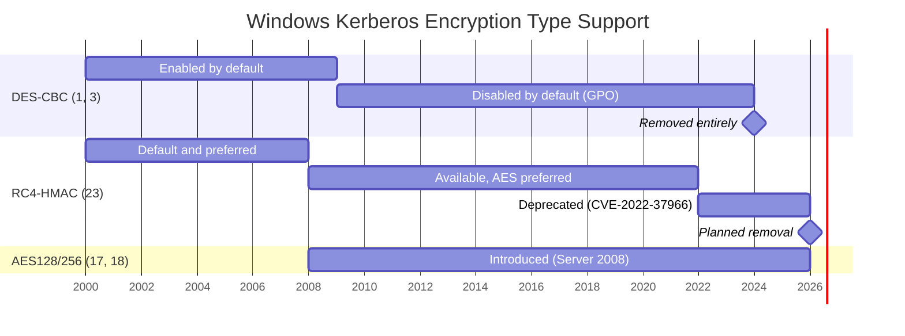

# Encryption Types

Five Kerberos encryption types have been used in Active Directory. How each one derives its key determines what you're cracking and how fast.

```mermaid
flowchart LR
    P["Password"] --> DES_PATH & RC4_PATH & AES_PATH

    subgraph DES_PATH["DES (etype 1, 3)"]
        direction TB
        D1["+ Salt: REALMusername"]
        D2["DES string-to-key"]
        D3["56-bit DES key"]
        D1 --> D2 --> D3
    end

    subgraph RC4_PATH["RC4 (etype 23)"]
        direction TB
        R1["UTF-16LE encode"]
        R2["MD4 hash"]
        R3["128-bit NT hash = key"]
        R1 --> R2 --> R3
    end

    subgraph AES_PATH["AES (etype 17, 18)"]
        direction TB
        A1["+ Salt: REALMusername"]
        A2["PBKDF2-SHA1<br/>4096 iterations"]
        A3["128 or 256-bit AES key"]
        A1 --> A2 --> A3
    end

    style RC4_PATH fill:#4a2020,stroke:#ff6b6b
    style DES_PATH fill:#4a4a20,stroke:#ffd93d
    style AES_PATH fill:#1a3a1a,stroke:#6bcb77
```

RC4 has **no salt** and uses a single fast hash (MD4). AES uses a salt and 4096 PBKDF2 iterations. DES uses a salt but has a tiny 56-bit keyspace.

---

## DES (etypes 1 and 3)

DES-CBC-CRC (etype 1) and DES-CBC-MD5 (etype 3) came from MIT Kerberos and shipped with Windows 2000. Both use 56-bit DES; they differ only in the integrity check (CRC32 for etype 1, MD5 for etype 3).

Both etypes produce the same key from the same password. 56 bits is brute-forceable no matter what the password is. A 50-character passphrase and a 3-character password both reduce to the same 56-bit key. You're attacking the key, not the password, so password policy doesn't matter.

DES was disabled by default in Server 2008 R2 (2009), re-enableable via GPO or the `USE_DES_KEY_ONLY` account flag. Removed entirely in Server 2025. Legacy environments in healthcare, manufacturing, and government still run it.

| Property | Value |
|----------|-------|
| **Key size** | 56 bits effective (8 bytes with parity) |
| **Key derivation** | MIT DES string-to-key (password + salt) |
| **Salt** | `REALM` + `username` (e.g., `CONTOSO.COMAdmin`) |
| **Introduced** | Windows 2000 |
| **Disabled by default** | Server 2008 R2 |
| **Removed** | Server 2025 |

## RC4-HMAC (etype 23)

Microsoft added RC4-HMAC in Windows 2000 to bridge NTLM and Kerberos. Key derivation: take the password, encode as UTF-16LE, MD4 hash it. Done. The result is the NT hash, and the NT hash **is** the RC4 key.

**There is no salt.** Same password, same key, regardless of username or domain. An NT hash pulled from one machine works as a Kerberos key on any DC in the domain. Pass-the-hash and overpass-the-hash both work because of this. The NT hash is completely portable.

Hashcat only has to compute `MD4(UTF-16LE(candidate))` per guess. No salt means one attempt applies to every RC4 hash in your file at once.

| Property | Value |
|----------|-------|
| **Key size** | 128 bits (16 bytes) |
| **Key derivation** | `MD4(UTF-16LE(password))` = NT hash |
| **Salt** | None |
| **Introduced** | Windows 2000 |
| **Deprecated** | RFC 8429 (2018), CVE-2022-37966 patches |
| **Being removed** | Server 2025+ (phased rollout through 2026) |

## AES128 and AES256 (etypes 17 and 18)

AES128-CTS-HMAC-SHA1-96 (etype 17) and AES256-CTS-HMAC-SHA1-96 (etype 18) shipped with Vista and Server 2008. Key derivation uses PBKDF2-HMAC-SHA1 with 4096 iterations over a salted password. Much slower to crack than RC4.

Same derivation for both, just different output length (16 bytes for AES128, 32 for AES256). AES256 is the default on modern domains.

| Property | AES128 (etype 17) | AES256 (etype 18) |
|----------|-------------------|-------------------|
| **Key size** | 16 bytes (128 bits) | 32 bytes (256 bits) |
| **Key derivation** | PBKDF2-HMAC-SHA1, 4096 iterations | Same |
| **Salt** | `REALM` + `username` | Same |
| **Introduced** | Server 2008 / Vista | Same |

!!! note "AES is slower to crack, not impossible"
    The 4096 PBKDF2 iterations make AES roughly 600x slower to crack than RC4 per candidate password. But weak passwords are still weak. `Password1!` falls in seconds even with AES.

---

## Salt computation

Salt gets concatenated with the password during key derivation. Same password on two different accounts = different keys. Computation varies by etype:

```mermaid
flowchart TD
    A{Which etype?} -->|"RC4 (23)"| B["No salt needed<br/>Key = MD4(UTF-16LE(password))"]
    A -->|"DES (1, 3) or AES (17, 18)"| C{Account type?}

    C -->|"User account<br/>(e.g., Admin)"| D["Salt = REALM + username<br/>CONTOSO.COMAdmin"]
    C -->|"Machine account<br/>(e.g., DC01$)"| E["Salt = REALM + host + hostname.realm<br/>CONTOSO.COMhostdc01.contoso.com"]

    D & E --> F["Key = string-to-key(password, salt)"]
    B --> G["Key ready"]
    F --> G

    style B fill:#4a2020,stroke:#ff6b6b
    style G fill:#1a3a1a,stroke:#6bcb77
```

| Etype | Salt | Example |
|-------|------|---------|
| **DES** (1, 3) | `REALM` (uppercase) + `username` (case-preserved) | `CONTOSO.COMAdmin` |
| **RC4** (23) | **None** — the key is just `MD4(UTF-16LE(password))` | — |
| **AES** (17, 18) | `REALM` (uppercase) + `username` (case-preserved) | `CONTOSO.COMAdmin` |

For **machine accounts** (sAMAccountName ending with `$`), the salt changes:

| Etype | Machine account salt | Example |
|-------|---------------------|---------|
| **DES / AES** | `REALM` + `host` + `hostname.realm` (all lowercase) | `CONTOSO.COMhostdc01.contoso.com` |

The salt matters because **hashcat needs it to derive the key**. For AES hashes, the username and realm in the hash string aren't just labels; they're cryptographic inputs. Wrong username or realm = wrong key = cracking silently fails even with the right password.

RC4 has no salt, which is why it cracks fast and why pass-the-hash works. One NT hash candidate applies to every RC4 hash in your file at once.

---

## msDS-SupportedEncryptionTypes

Each account's supported etypes are stored in the `msDS-SupportedEncryptionTypes` AD attribute. The KDC checks this bitmask when issuing tickets.

```mermaid
block-beta
    columns 5
    b4["Bit 4<br/>AES256<br/>0x10"]:1
    b3["Bit 3<br/>AES128<br/>0x08"]:1
    b2["Bit 2<br/>RC4<br/>0x04"]:1
    b1["Bit 1<br/>DES-MD5<br/>0x02"]:1
    b0["Bit 0<br/>DES-CRC<br/>0x01"]:1

    style b4 fill:#1a3a1a,stroke:#6bcb77
    style b3 fill:#1a3a1a,stroke:#6bcb77
    style b2 fill:#4a4a20,stroke:#ffd93d
    style b1 fill:#4a2020,stroke:#ff6b6b
    style b0 fill:#4a2020,stroke:#ff6b6b
```

| Bit | Value | Encryption type |
|-----|-------|-----------------|
| 0 | 0x01 | DES-CBC-CRC |
| 1 | 0x02 | DES-CBC-MD5 |
| 2 | 0x04 | RC4-HMAC |
| 3 | 0x08 | AES128 |
| 4 | 0x10 | AES256 |

Common values you'll see:

| Value | Meaning |
|-------|---------|
| **0** (not set) | KDC uses domain default — historically RC4+AES, now AES-only on newer DCs |
| **0x04** | RC4 only |
| **0x18** | AES128 + AES256 (the "AES required" checkbox in ADUC) |
| **0x1C** | RC4 + AES128 + AES256 |
| **0x1F** | All five encryption types |

`kw-roast --ldap` queries for accounts with `servicePrincipalName` set. The KDC picks the etype for the ticket based on this bitmask. On Server 2019+, the DC uses the strongest etype the service supports and ignores your RC4 request, so you might pass `-e rc4` and still get an AES256 ticket back.

---

## Windows version timeline

| Version | Year | Supported etypes | Key change |
|---------|------|-----------------|------------|
| **Windows 2000** | 2000 | DES-CBC-CRC, DES-CBC-MD5, RC4-HMAC | Kerberos introduced to Windows. RC4 is the default. |
| **Server 2003** | 2003 | DES, RC4 | Last version without AES support. |
| **Server 2008** | 2008 | DES, RC4, AES128, AES256 | **AES introduced.** All five etypes available. |
| **Server 2008 R2** | 2009 | RC4, AES (DES disabled) | **DES disabled by default.** GPO to re-enable. |
| **Server 2012 R2** | 2013 | RC4, AES | Protected Users group forces AES-only. |
| **Server 2019** | 2018 | RC4, AES | **Kerberoast mitigation**: DC honors service's strongest etype, not attacker's request. |
| **Server 2022** | 2021 | RC4, AES | CVE-2022-37966: default session key changed from RC4 to AES. |
| **Server 2025** | 2024 | AES (RC4 being phased out) | **DES removed entirely.** RC4 phase-out begins (AES-only default planned for 2026). |
