# Hash Formats

How KerbWolf gets from a Kerberos packet to a crackable hash string. Covers the extraction, cipher splitting, and format tables for hashcat and John.

See also: [main guide](index.md), [encryption types](encryption-types.md).

---

## From packet to hash

Kerberos message comes in, ASN.1 gets decoded, cipher bytes get pulled out, split by etype, hex-encoded, and written as a hashcat/John string.

```mermaid
flowchart TD
    A["Kerberos message<br/>(AS-REQ, AS-REP, or TGS-REP)"] --> B["Decode ASN.1 structure"]
    B --> C["Locate EncryptedData field"]
    C --> D["Read etype + cipher bytes"]
    D --> E{Which etype?}

    E -->|"RC4 (23)"| F["Split: first 16 bytes = checksum<br/>remaining = edata2"]
    E -->|"AES (17/18)"| G["Split: last 12 bytes = checksum<br/>remaining = edata2"]
    E -->|"DES (1/3)"| H["No split: full cipher blob"]

    F --> I["Format: $krb5tgs$23$*user$realm$spn*$checksum$edata2"]
    G --> J["Format: $krb5tgs$18$user$realm$*spn*$checksum$edata2"]
    H --> K["Format: $krb5tgs$3$user$realm$*spn*$cipher"]

    I & J & K --> L["hashcat / john"]
    L --> M["Cracked password or DES key"]

    style E fill:#2a2a4a,stroke:#8b8bff
    style L fill:#1a3a1a,stroke:#6bcb77
    style M fill:#3a1a1a,stroke:#ff6b6b
```



### Walkthrough: RC4 TGS-REP

You Kerberoasted an account and got a TGS-REP. What happens next:

**Step 1: Extract the cipher.** The TGS-REP is an ASN.1 structure. Inside it: `ticket` → `enc-part` → `etype` (23) and `cipher` (raw bytes). The cipher is the encrypted `EncTicketPart` (the service account's key was used to encrypt it).

**Step 2: Split the cipher.** For RC4 (etype 23), the cipher is structured as `checksum || edata2`:

- **Checksum**: the first 16 bytes — an HMAC-MD5 over the encrypted data
- **Edata2**: everything after the first 16 bytes — the actual encrypted ticket data

**Step 3: Format the hash.** Hex-encode both parts and arrange them into the hashcat format:

```
$krb5tgs$23$*svc_sql$CORP.LOCAL$MSSQLSvc/db01.corp.local*$<checksum_32hex>$<edata2_hex>
```

**Step 4: Hashcat cracks it.** For each candidate password, hashcat computes `MD4(UTF-16LE(password))` to get an NT hash, uses it to decrypt `edata2`, and checks whether the HMAC-MD5 matches `checksum`. If it matches, the password is found.

```mermaid
flowchart LR
    subgraph RC4["RC4 cracking (fast)"]
        direction TB
        R1["Candidate password"] --> R2["MD4(UTF-16LE(pw))"]
        R2 --> R3["NT hash = RC4 key"]
        R3 --> R4["Decrypt edata2"]
        R4 --> R5{"HMAC-MD5<br/>matches?"}
        R5 -->|Yes| R6["Cracked!"]
        R5 -->|No| R1
    end

    subgraph AES["AES cracking (slow)"]
        direction TB
        A1["Candidate password"] --> A2["+ salt (realm+user)"]
        A2 --> A3["PBKDF2-SHA1<br/>4096 iterations"]
        A3 --> A4["AES key"]
        A4 --> A5["Decrypt edata2"]
        A5 --> A6{"HMAC-SHA1<br/>matches?"}
        A6 -->|Yes| A7["Cracked!"]
        A6 -->|No| A1
    end

    style R6 fill:#1a3a1a,stroke:#6bcb77
    style A7 fill:#1a3a1a,stroke:#6bcb77
```



---

## How the split differs by etype

Where the checksum lives depends on the etype, not on which attack produced it. RC4 checksum is always the first 16 bytes. AES checksum is always the last 12. Doesn't matter if it came from a TGS-REP, AS-REP, or AS-REQ.

```mermaid
block-beta
    columns 6

    block:rc4label:1
        rc4t["RC4<br/>(etype 23)"]
    end
    block:rc4check:2
        rc4c["Checksum (16 bytes)<br/>HMAC-MD5"]
    end
    block:rc4data:3
        rc4d["Edata2 (remaining bytes)<br/>RC4-encrypted data"]
    end

    block:aeslabel:1
        aest["AES<br/>(etype 17/18)"]
    end
    block:aesdata:4
        aesd["Edata2 (N − 12 bytes)<br/>AES-CTS encrypted data"]
    end
    block:aescheck:1
        aesc["Checksum<br/>(12 bytes)"]
    end

    block:deslabel:1
        dest["DES<br/>(etype 1/3)"]
    end
    block:desdata:5
        desd["Full cipher blob (confounder + integrity + data)<br/>No split — brute-force the 56-bit key"]
    end

    style rc4check fill:#4a2020,stroke:#ff6b6b
    style rc4data fill:#1a3a3a,stroke:#6bcbcb
    style aesdata fill:#1a3a3a,stroke:#6bcbcb
    style aescheck fill:#4a2020,stroke:#ff6b6b
    style desdata fill:#3a3a1a,stroke:#ffd93d
```



| Etype | Cipher layout | Checksum | Edata2 | Hashcat verification |
|-------|--------------|----------|--------|---------------------|
| **RC4** (23) | `checksum \|\| edata2` | First 16 bytes (HMAC-MD5) | Remaining bytes | Derive NT hash → decrypt → check HMAC |
| **AES128** (17) | `edata2 \|\| checksum` | Last 12 bytes (HMAC-SHA1 truncated) | All but last 12 bytes | PBKDF2 → AES key → decrypt → check HMAC |
| **AES256** (18) | `edata2 \|\| checksum` | Last 12 bytes (HMAC-SHA1 truncated) | All but last 12 bytes | Same as AES128, longer key |
| **DES** (1, 3) | `cipher` (no split) | Embedded in plaintext (CRC32 or MD5) | Full encrypted blob | Brute-force 56-bit key → decrypt → check integrity |

!!! tip "The etype determines the format, the attack determines the source"
    The hash format (where the checksum lives, how many bytes) is the same for all three attacks at the same etype. The only thing the attack type changes is *which ASN.1 field* the cipher is extracted from.

### Where the cipher comes from (by attack type)

| Attack | Kerberos message | ASN.1 path to cipher |
|--------|-----------------|---------------------|
| **AS-REQ Pre-Auth** | AS-REQ | `padata` → `PA-ENC-TIMESTAMP` → `EncryptedData.cipher` |
| **AS-REP Roast** | AS-REP | `enc-part` → `EncryptedData.cipher` |
| **TGS-REP Roast** | TGS-REP | `ticket` → `enc-part` → `EncryptedData.cipher` |

---

## Hashcat format (default)

### TGS-REP Roast (`$krb5tgs$`)

| Etype | Mode | Format |
|-------|------|--------|
| RC4 (23) | 13100 | `$krb5tgs$23$*user$realm$spn*$checksum$edata2` |
| AES128 (17) | 19600 | `$krb5tgs$17$user$realm$*spn*$checksum$edata2` |
| AES256 (18) | 19700 | `$krb5tgs$18$user$realm$*spn*$checksum$edata2` |
| DES-CBC-CRC (1) | proposed | `$krb5tgs$1$user$realm$*spn*$cipher` |
| DES-CBC-MD5 (3) | proposed | `$krb5tgs$3$user$realm$*spn*$cipher` |

### AS-REP Roast (`$krb5asrep$`)

| Etype | Mode | Format |
|-------|------|--------|
| RC4 (23) | 18200 | `$krb5asrep$23$user@realm:checksum$edata2` |
| AES128 (17) | 32100 | `$krb5asrep$17$user$realm$checksum$edata2` |
| AES256 (18) | 32200 | `$krb5asrep$18$user$realm$checksum$edata2` |
| DES-CBC-CRC (1) | proposed | `$krb5asrep$1$user$realm$cipher` |
| DES-CBC-MD5 (3) | proposed | `$krb5asrep$3$user$realm$cipher` |

### AS-REQ Pre-Auth (`$krb5pa$`)

| Etype | Mode | Format |
|-------|------|--------|
| RC4 (23) | 7500 | `$krb5pa$23$user$realm$$edata2checksum` |
| AES128 (17) | 19800 | `$krb5pa$17$user$realm$edata2checksum` |
| AES256 (18) | 19900 | `$krb5pa$18$user$realm$edata2checksum` |
| DES-CBC-CRC (1) | proposed | `$krb5pa$1$user$realm$cipher` |
| DES-CBC-MD5 (3) | proposed | `$krb5pa$3$user$realm$cipher` |

!!! note "The double-dollar in RC4 AS-REQ"
    The RC4 AS-REQ hash (mode 7500) has an empty salt field between `realm` and the hash data, producing `$$`. The hash data is edata2 (72 hex chars) followed by checksum (32 hex chars) as one concatenated field.

---

## John the Ripper format

Use `--format john` to output hashes for John. All 9 RC4/AES modes are verified cracking.

| Attack | Etype | John `--format=` | Notes |
|--------|-------|-----------------|-------|
| TGS-REP | RC4 | `krb5tgs` | Same structure as hashcat |
| TGS-REP | AES | `krb5tgs-sha1` | No `*spn*` wrapper, different field order |
| AS-REP | RC4 | `krb5asrep` | No username in hash (just `$checksum$edata2`) |
| AS-REP | AES | `krb5asrep` | `$REALMuser$edata2$checksum` (realm+user concatenated) |
| AS-REQ | RC4 | `krb5pa-md5` | Same as hashcat |
| AS-REQ | AES | `krb5pa-sha1` | Adds empty salt field: `$krb5pa$17$user$realm$$edata2checksum` |
| Any | DES-CBC-MD5 | `krb5-3` | `$krb3$REALMuser$cipher` |
| Any | DES-CBC-CRC | — | No native John support; falls back to hashcat format |

---

## Cracking examples

```bash
# Hashcat — TGS-REP Roast
hashcat -m 13100 hashes.txt wordlist.txt    # RC4
hashcat -m 19600 hashes.txt wordlist.txt    # AES128
hashcat -m 19700 hashes.txt wordlist.txt    # AES256

# Hashcat — AS-REP Roast
hashcat -m 18200 hashes.txt wordlist.txt    # RC4
hashcat -m 32100 hashes.txt wordlist.txt    # AES128
hashcat -m 32200 hashes.txt wordlist.txt    # AES256

# Hashcat — AS-REQ Pre-Auth
hashcat -m 7500  hashes.txt wordlist.txt    # RC4
hashcat -m 19800 hashes.txt wordlist.txt    # AES128
hashcat -m 19900 hashes.txt wordlist.txt    # AES256

# John the Ripper
john --format=krb5tgs hashes.txt --wordlist=wordlist.txt           # TGS RC4
john --format=krb5tgs-sha1 hashes.txt --wordlist=wordlist.txt      # TGS AES
john --format=krb5asrep hashes.txt --wordlist=wordlist.txt         # AS-REP (auto)
john --format=krb5pa-md5 hashes.txt --wordlist=wordlist.txt        # AS-REQ RC4
john --format=krb5pa-sha1 hashes.txt --wordlist=wordlist.txt       # AS-REQ AES
```
